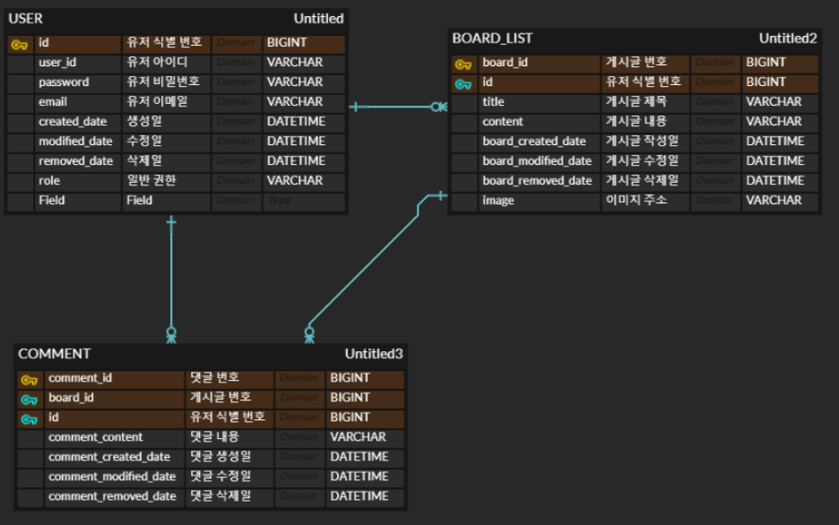

# 게시판 요구사항 정의서

<h2>프로젝트 기능 및 설계</h2>
<body>
    <table>
        <tr>
            <th> <strong>대분류</strong> </th>
            <th> <strong>중분류</strong> </th>
            <th> <strong>소분류</strong> </th>
            <th> <strong>필수여부</strong> </th>
            <th> <strong>요구사항 내용</strong> </th>
        </tr>
        <tr>
            <td rowspan="21">게시판</td>
            <td>비회원</td>
            <td>회원가입</td>
            <td>회원가입</td>
            <td>- 사용자는 회원가입을 할 수 있다. 
                - 일반적으로 모든 사용자는 회원가입시 USER(일반권한)을 지닌다. 
                - 회원가입시 ID, PW, nickname, E-mail을 입력받으며, ID, nickname은 unique해야 한다. </td>
        </tr>
        <tr>
            <td rowspan="5">회원</td>
            <td>로그인기능</td>
            <td>로그인</td>
            <td>DB에 저장되어있는 ID, PW가 일치하여야 로그인 가능하다.</td>
        </tr>
        <tr>
            <td rowspan="4">회원 설정</td>
            <td>아이디 찾기</td>
            <td>- 회원가입한 E-mail을 입력하여 해당 되는 ID를 E-mail로
                전송 - 회원가입한 ID가 없을 경우 회원가입 이력 없음 표출 </td>
        </tr>
        <tr>
            <td>비밀번호 찾기</td>
            <td>- 회원가입한 ID, E-mail을 입력하여 해당 PW를
                E-mail로 전송 - 회원가입한 ID가 없을 경우 회원가입 이력 없음 표출 </td>
        </tr>
        <tr>
            <td>비밀번호 변경</td>
            <td>- 로그인 된 상태에서 설정 페이지 PW 변경을 선택 후 변경 전 PW를 입력받아 변경할 PW입력 후 PW변경 가능 
                - 변경 전 PW와 동일한 경우 변경 불가 </td>
        </tr>
        <tr>
            <td>닉네임 변경</td>
            <td>- 로그인 된 상태에서 설정 페이지에서 중복검사 후 닉네임 변경 
                - nickname은 unique 해야 한다. </td>
        </tr>
        <tr>
            <td rowspan="4">회원/비회원</td>
            <td rowspan="4">게시글 목록/조회</td>
            <td>게시글 목록 표시</td>
            <td>- 게시물 목록에서는 글 번호, 제목, 작성자, 작성일, 조회수 순으로 표시 - 게시글은 최신 등록일 기준 오름차순으로 기본 정렬 된다. </td>
        </tr>
        <tr>
            <td>게시글 목록 페이징 처리</td>
            <td>게시물 목록에서 한 페이지에 최대 10개의 게시글만 표시</td>
        </tr>
        <tr>
            <td>게시글 조회</td>
            <td>- 게시물 상세조회 페이지로 이동 
                - 게시글 작성자, 제목, 작성일, 내용, 댓글 목록, 댓글 입력창 순으로 조회 
                - 사용자가 작성한 게시글인 경우 수정, 삭제 버튼 표시 </td>
        </tr>
        <tr>
            <td>게시글 검색</td>
            <td>- 제목, 작성자 카테고리 검색 기준 
                - 해당 키워드에 일치하는 게시글 목록 조회 </td>
        </tr>
        <tr>
            <td rowspan="4">회원</td>
            <td rowspan="4">게시글 등록/수정/삭제</td>
            <td>개시글 등록</td>
            <td>- 게시글 제목, 내용 둘 다 입력해야 등록 가능 
                - 게시글 제목 중복되지 않을 경우 등록 가능 
                - 게시글 등록 후 게시글 목록 페이지로 이동 </td>
        </tr>
        <tr>
            <td>게시글 이미지 등록</td>
            <td>- 게시글 등록 페이지에서 이미지 업로드 가능 
                - 게시글 하나당 최대 5개의 파일만 업로드 가능 - (이미지 용량제한으로 변경 할수도) </td>
        </tr>
        <tr>
            <td>게시글 수정</td>
            <td>- 자신이 등록한 게시글만 수정 가능 
                - 게시글 등록 페이지에서 게시글 제목, 내용 둘 다 입력해야 수정 가능 - 게시글 제목 중복되지 않을 경우 수정 가능 - 게시글 수정 후 게시글 목록 페이지로
                이동 </td>
        </tr>
        <tr>
            <td>게시글 삭제</td>
            <td>- 자신이 등록한 게시글만 삭제 가능 
                - 게시글 삭제 후 게시글 목록 페이지로 이동 </td>
        </tr>
        <tr>
            <td>회원/비회원</td>
            <td rowspan="4">댓글</td>
            <td>댓글 목록 표시</td>
            <td>- 게시글 상세조회 페이지 하단에 최신 등록일 기준 오름차순으로 표출 
                - 댓글 목록에서는 댓글 번호, 내용, 작성자, 작성일 순으로 표시 </td>
        </tr>
        <tr>
            <td rowspan="3">회원</td>
            <td>댓글 작성</td>
            <td>댓글 내용 입력해야 등록 가능</td>
        </tr>
        <tr>
            <td>댓글 수정</td>
            <td>- 자신이 등록한 댓글만 수정 가능 
                - 해당 게시글 상세조회 페이지에서 내용 입력해야 수정 가능 </td>
        </tr>
        <tr>
            <td>댓글 삭제</td>
            <td>- 자신이 등록한 댓글만 삭제 가능 
                - 댓글 삭제 후 해당 게시글 상세 조회 페이지로 이동 </td>
        </tr>
        <tr>
            <td rowspan="3">관리자</td>
            <td rowspan="3">관리자 로그인</td>
            <td>회원 관리</td>
            <td>- 관리자 페이지에서 회원수, 게시물 수, 댓글 수 순으로 표시
            </td>
        </tr>
        <tr>
            <td>게시글 관리</td>
            <td>- 게시물 관리 페이지에서 게시물 번호, 작성자, 제목, 작성일 순으로 표시 
                - 회원 게시물 검색 기능 
                - 체크박스로 게시물 전체선택 및 일부선택으로 삭제 가능 </td>
        </tr>
        <tr>
            <td>댓글 관리</td>
            <td>- 댓글 관리 페이지에서 작성자, 게시물, 댓글 내용, 작성일 순으로 표시 
                - 체크박스로 게시물 전체선택 및 일부선택으로 삭제 가능 </td>
        </tr>
    </table>

<h2>ERD</h2>

</body>
